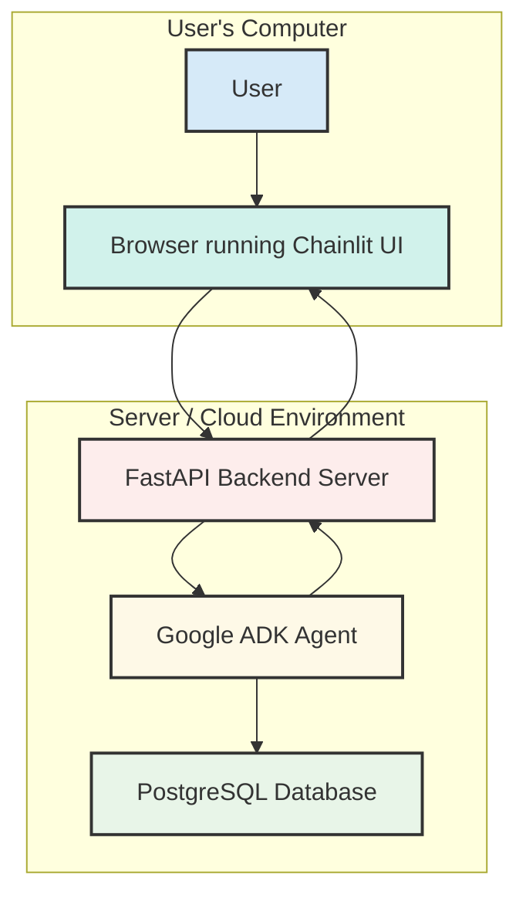

# AI Consultant Assistant

An intelligent AI agent designed to support the complete consulting process, from initial research to final report generation for clients.

## Overview

This project implements an AI-powered consultant assistant that leverages Chainlit for the frontend interface and FastAPI with Google ADK (Agent Development Kit) for the backend processing. The system is designed to streamline consulting workflows by providing intelligent assistance throughout the entire consulting lifecycle.

## Architecture

The system follows a modern client-server architecture with clear separation of concerns:



**Flow Steps:**
1. **User** interacts with **Browser running Chainlit UI**
2. **Browser** sends HTTP POST request to **FastAPI Backend Server**
3. **FastAPI** calls the **Google ADK Agent** function
4. **ADK Agent** queries and stores data in **PostgreSQL Database**
5. **ADK Agent** returns results to **FastAPI**
6. **FastAPI** sends HTTP response back to **Browser**

### Component Breakdown

#### Frontend (Chainlit UI)
- **Technology**: Chainlit framework
- **Purpose**: Provides an intuitive chat interface for users
- **Features**: Real-time messaging, file uploads, interactive elements
- **Communication**: HTTP POST requests to FastAPI backend

#### Backend (FastAPI + ADK + Database)
- **API Server**: FastAPI for RESTful API endpoints
- **AI Agent**: Google ADK (Agent Development Kit) for intelligent processing
- **Database**: PostgreSQL for data persistence and retrieval
- **Responsibilities**: 
  - Request validation and routing
  - Agent orchestration
  - Data persistence and retrieval
  - Response formatting and delivery

## Features

### Consulting Process Support
- **Research Phase**: Automated data gathering and analysis
- **Analysis Phase**: Intelligent insights and recommendations
- **Report Generation**: Automated report creation and formatting
- **Client Communication**: Professional response drafting

### AI Capabilities
- Natural language processing for client queries
- Automated research and data synthesis
- Intelligent report generation
- Context-aware consulting recommendations

## Technology Stack

### Frontend
- **Chainlit**: Modern chat interface framework
- **Python**: Core programming language
- **HTTP/HTTPS**: Communication protocol

### Backend
- **FastAPI**: High-performance web framework
- **Google ADK**: Agent Development Kit for AI capabilities
- **Python**: Backend programming language
- **Pydantic**: Data validation and serialization
- **PostgreSQL**: Relational database for data persistence

## Getting Started

### Prerequisites
- Python 3.8+
- pip package manager
- Google ADK access (if required)

### Installation

1. **Clone the repository**
   ```bash
   git clone <repository-url>
   cd ai-consultant-assistant
   ```

2. **Install dependencies**
   ```bash
   pip install -r requirements.txt
   ```

3. **Configure environment variables**
   ```bash
   cp .env.example .env
   # Edit .env with your configuration
   ```

4. **Start the backend server**
   ```bash
   python -m uvicorn main:app --reload --host 0.0.0.0 --port 8001
   ```

5. **Start the Chainlit frontend**
   ```bash
   chainlit run frontend/app.py --port 8000
   ```

### Usage

1. Open your browser and navigate to `http://localhost:8000`
2. Start a conversation with the AI consultant
3. Upload documents or provide context for your consulting needs
4. Receive intelligent responses and recommendations

## API Endpoints

### Chat Endpoint
- **URL**: `POST /chat`
- **Purpose**: Process user messages and return AI responses
- **Request Body**: 
  ```json
  {
    "message": "string",
    "context": "optional_context"
  }
  ```
- **Response**: 
  ```json
  {
    "reply": "AI response content",
    "metadata": "additional information"
  }
  ```

## Development

### Project Structure
```
ai-consultant-assistant/
├── frontend/           # Chainlit UI components
├── backend/           # FastAPI server and ADK agent
├── docs/             # Documentation
├── tests/            # Test files
├── requirements.txt   # Python dependencies
└── README.md         # This file
```

### Contributing
1. Fork the repository
2. Create a feature branch
3. Make your changes
4. Add tests for new functionality
5. Submit a pull request

## License

[Add your license information here]

## Support

For questions and support, please open an issue in the repository or contact the development team.